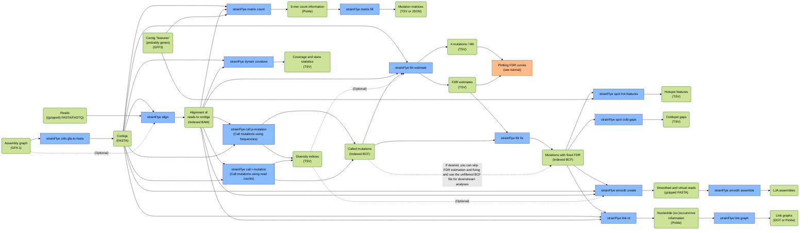

# strainFlye

<a href="https://github.com/fedarko/strainFlye/actions/workflows/main.yml"></a>
<a href="https://codecov.io/gh/fedarko/strainFlye"></a>
<a href="https://anaconda.org/bioconda/strainflye"></a>

strainFlye is a pipeline for calling, analyzing, and phasing rare
single-nucleotide mutations in metagenome-assembled genomes produced from
long and accurate reads—for example, PacBio HiFi reads.

The main inputs to strainFlye are 1) reads and 2) contigs.
However, most steps in the pipeline can be "jumped to" if you already have
other files prepared (e.g. an alignment of reads to contigs, or
existing single-nucleotide mutation calls within contigs). See below for a
flow chart of strainFlye's pipeline (created with
[Mermaid](https://github.com/mermaid-js/mermaid)). If you have trouble viewing
this flow chart, [here are some other ways to view
it](https://github.com/fedarko/strainFlye/issues/56#issuecomment-1532479959).



## Installation

Long story short, strainFlye is an ordinary Python package (currently
supporting Python 3.6 and 3.7). strainFlye depends on a few non-Python tools
(e.g. minimap2, Prodigal, SAMtools), also.

### Installation using conda (recommended)

The simplest way to install strainFlye is by using
[conda](https://conda.io/). strainFlye is available through the
[bioconda](https://bioconda.github.io/) channel:

```bash
conda install -c bioconda strainflye
```

(If you run into dependency conflicts when installing strainFlye into an
existing conda environment, you may want to just create a new conda environment
and install strainFlye into that.)

### Installation from source

Please see the development documentation ([`CONTRIBUTING.md`](https://github.com/fedarko/strainFlye/blob/main/CONTRIBUTING.md)) for instructions.

### Optional: install LJA in order to run `strainFlye smooth assemble`

strainFlye's `smooth` module includes two commands. The first,
`strainFlye smooth create`, creates smoothed and virtual reads for each contig;
the second, `strainFlye smooth assemble`, assembles these reads using
[LJA](https://github.com/AntonBankevich/LJA). LJA is not installed using the
conda installation instructions above, so—in order to run the
`strainFlye smooth assemble` command—you will need to
install the LJA software (in particular, the
[`simple_ec` branch](https://github.com/AntonBankevich/LJA/tree/simple_ec) of
LJA).

Please see [LJA's manual](https://github.com/AntonBankevich/LJA/blob/main/docs/lja_manual.md)
for the most up-to-date installation instructions. Assuming that you have all
of LJA's requirements installed, something like the following should work:

```bash
git clone https://github.com/AntonBankevich/LJA.git
cd LJA
git checkout simple_ec
cmake .
make
```

... but this is subject to change as LJA is updated.

## Documentation

### Tutorial

**[This Jupyter Notebook](https://nbviewer.org/github/fedarko/strainFlye/blob/main/docs/SheepGutExample.ipynb)** provides a tutorial demonstrating how to use strainFlye.

### Command-line usage

First, make sure you've activated the conda environment into which you
installed strainFlye. From there, you can use strainFlye like any other
command-line tool:

<!-- STARTDOCS -->
```
Usage: strainFlye [OPTIONS] COMMAND [ARGS]...

  Pipeline for the analysis of rare mutations in metagenomes.

  Please consult https://github.com/fedarko/strainFlye if you have any
  questions, comments, etc. about strainFlye. Thank you for using this tool!

Options:
  -v, --version  Show the version and exit.
  -h, --help     Show this message and exit.

Commands:
  align   Align reads to contigs, and filter the resulting alignment.
  call    [+] Call mutations in contigs naïvely & compute diversity indices.
  fdr     [+] Estimate and fix FDRs for contigs' naïve mutation calls.
  spot    [+] Identify putative mutational hotspots or coldspots.
  smooth  [+] Create and assemble smoothed and virtual reads.
  link    [+] Create link graphs showing co-occurring alleles.
  matrix  [+] Create codon and amino acid mutation matrices.
  dynam   [+] Compute simple information about growth dynamics.
  utils   [+] Miscellaneous utility commands provided with strainFlye.
```

### Quick descriptions of each strainFlye command

Click on the headers below (e.g. "**Alignment**") to show details about the corresponding command(s).
Input files / folders are listed in parentheses next to each command; optional
inputs are given in [square brackets]. Parameters are omitted for the sake of brevity.
For more details, try running these commands from the terminal (e.g. `strainFlye align --help`).

<!-- for some reason, <strong> was the only way i found to make summary text bold here successfully:
https://codedragontech.com/createwithcodedragon/how-to-style-html-details-and-summary-tags/ -->
<details>
  <summary><strong>Alignment</strong></summary>

- `strainFlye align` (contigs, reads, [GFA]) → BAM
  
  - Aligns reads to contigs using [minimap2](https://github.com/lh3/minimap2).
  - Filters this alignment to remove certain types of problematic alignments.
</details>

<details>
  <summary><strong>Naïve mutation identification, FDR estimation, and FDR fixing</strong></summary>

- `strainFlye call p-mutation` and `strainFlye call r-mutation` (contigs, BAM) → (BCF, diversity indices)
  - Naïvely calls either _p_-mutations (frequency-based) or _r_-mutations (read-count-based).
  - Computes diversity indices.

- `strainFlye fdr estimate` (contigs, BAM, BCF, [diversity indices]) → (FDR estimates, # mutations / Mb)
  - Estimates the FDRs of naïve mutation calls from `strainFlye call` using the target-decoy approach.
  - Computes FDR estimates, and the number of naïvely called mutations per megabase, for each "target" (non-decoy) contig. These values can be used to plot FDR curves showing how the FDR estimate for a target contig varies as _p_ or _r_ varies.

- `strainFlye fdr fix` (BCF, FDR estimates) → BCF
  - Given a fixed FDR (e.g. _f = 1%_), returns a filtered BCF file with all target contigs' mutations filtered to use a threshold of _p_ or _r_ yielding an FDR estimate ≤ _f_.
</details>
  
<details>
  <summary><strong>Hotspot and coldspot identification</strong></summary>

- `strainFlye spot hot-features` (BCF, [GFF3](https://github.com/The-Sequence-Ontology/Specifications/blob/master/gff3.md)) → hotspot TSV
  - Identifies "hotspot" features from the GFF3 file, based on simple configurable thresholds (e.g. to be a "hotspot," a feature must have at least _N_ mutations).

- `strainFlye spot cold-gaps` (BCF) → coldspot TSV
  - Identifies "coldspot" gaps between mutations, considering a gap to be a coldspot if it is at least a certain length.
  - Assigns a _p_-value to the longest coldspot gap seen in each contig. (Note that the computation of this _p_-value makes a few simplifying assumptions; see the supplemental material of our paper for details.)
</details>
  
<details>
  <summary><strong>Phasing</strong></summary>

- `strainFlye smooth create` (contigs, BAM, BCF, [diversity indices]) → smoothed and virtual reads
  - Creates smoothed and virtual reads for each contig. These correspond to the original reads, but modified to remove all differences from the assembled contigs (aside from the mutations in the BCF file).

- `strainFlye smooth assemble` (smoothed and virtual reads) → assemblies
  - Uses [LJA](https://github.com/AntonBankevich/LJA) to assemble smoothed and virtual reads.
  - See notes above about installing the `simple_ec` branch of LJA, which we rely on here.
  - For information on LJA's outputs (assembled sequences, assembly graph, etc.) please see [its manual](https://github.com/AntonBankevich/LJA/blob/main/docs/lja_manual.md).

- `strainFlye link nt` (contigs, BAM, BCF) → nucleotide (co-)occurrence information
  - Computes nucleotide (co-)occurrence information for each contig.
  - This information is stored in [pickle](https://docs.python.org/3/library/pickle.html) files.

- `strainFlye link graph` (nucleotide (co-)occurrence information) → link graphs
  - Converts the output of `strainFlye link nt` into link graphs (one per contig), representing which alleles of a contig tend to co-occur.
  - Depending on the `-f`/`--output-format` parameter, link graphs are saved to either [DOT](https://en.wikipedia.org/wiki/DOT_(graph_description_language)) files or to [pickle](https://docs.python.org/3/library/pickle.html) files (each pickle file corresponds to a serialized [NetworkX](https://networkx.org) representation of a link graph).
</details>
  
<details>
  <summary><strong>Mutation matrices</strong></summary>

- `strainFlye matrix count` (contigs, BAM, [GFF3](https://github.com/The-Sequence-Ontology/Specifications/blob/master/gff3.md)) → 3-mer count information
  - Counts 3-mers aligned to the codons in the coding sequences (`CDS` or `SO:0000316` features in the GFF3 file) in each contig.
  - This information is stored in [pickle](https://docs.python.org/3/library/pickle.html) files.

- `strainFlye matrix fill` (3-mer count information) → mutation matrices
  - Converts the output of `strainFlye matrix count` into codon and amino acid mutation matrices.
  - Each contig is represented by its own directory, containing four files: a codon mutation matrix, an amino acid mutation matrix, codon reference counts (the number of times we saw a codon in all the coding sequences of a contig, ignoring mutations), and amino acid reference counts.
  - Depending on the `-f`/`--output-format` parameter, these four files are saved as either TSV or JSON files.
</details>
  
<details>
  <summary><strong>Growth dynamics</strong></summary>

- `strainFlye dynam covskew` (contigs, BAM) → coverage and skew TSVs
  
  - Computes information about binned coverages and GC skews in each contig.

</details>

<details>
  <summary><strong>Miscellaneous utilities</strong></summary>

- `strainFlye utils gfa-to-fasta` (GFA) → FASTA
  
  - Converts a GFA 1 file to a FASTA file (and performs some sanity checking on it).

</details>
    
### Development documentation

If you're interested in making changes to strainFlye's code, please see
[`CONTRIBUTING.md`](https://github.com/fedarko/strainFlye/blob/main/CONTRIBUTING.md)
for some tips on getting started.

## Publication and citation

**An article describing strainFlye is available in _Genome Research_
[at this link](https://genome.cshlp.org/content/32/11-12/2119).** If you use
strainFlye in your work, please cite it! The BibTeX for this article is:

```
@article{fedarko2022,
  author={Fedarko, Marcus W and Kolmogorov, Mikhail and Pevzner, Pavel A},
  title={Analyzing rare mutations in metagenomes assembled using long and accurate reads},
  journal={Genome Research},
  publisher={Cold Spring Harbor Laboratory Press},
  volume={32},
  number={11-12},
  pages={2119--2133},
  year={2022},
  doi={10.1101/gr.276917.122},
  url={http://genome.cshlp.org/content/32/11-12/2119.abstract},
  eprint={http://genome.cshlp.org/content/32/11-12/2119.full.pdf+html}
}
```

### Citing "wrapped tools" within strainFlye

- If you use `strainFlye align`, please also cite minimap2 ([Li 2018](https://academic.oup.com/bioinformatics/article/34/18/3094/4994778)),
  which is used by this strainFlye command to perform alignment.
  (Depending on the version of minimap2 you use, you may also want to cite
  [Li 2021](https://academic.oup.com/bioinformatics/article/37/23/4572/6384570).)

- If you use `strainFlye smooth assemble`, please also cite LJA
  ([Bankevich _et al._, 2022](https://www.nature.com/articles/s41587-022-01220-6)),
  which is used by this strainFlye command to perform assembly.

## Miscellaneous notes about minor details you probably don't need to care about

### Shell injection (only relevant if this is hosted on a web server)

Some of strainFlye's commands use Python's
[`subprocess` module](https://docs.python.org/3/library/subprocess.html) to run
non-Python software: minimap2, samtools, bcftools, Prodigal, LJA, etc.
Most of the time, we do this using `subprocess.run()` with `shell=False`:
long story short, this helps prevent the problem of
[shell injection](https://en.wikipedia.org/wiki/Code_injection#Shell_injection).

However, as of writing, there are two places where strainFlye uses
`subprocess.run()` with `shell=True`: in `strainFlye align` (when running
minimap2 and samtools), and in `strainFlye smooth assemble` (when running LJA).
This is for convenience's sake, since we allow the user to pass in extra
parameters to these commands (the `--minimap2-params` option for `strainFlye
align`, and the `--lja-params` option for `strainFlye smooth assemble`).

Our use of `shell=True` in these two cases means that it's possible to make
these commands do unexpected things (see
[Python's documentation here](https://docs.python.org/3/library/subprocess.html#security-considerations) for details).
*This should not be a problem if you are running strainFlye directly.* However,
if you decide to host strainFlye on a server somewhere (and you allow users to
upload files, specify parameters, etc.) then you should be careful about
preventing shell injection in these cases. Feel free to open an issue if you
have any questions about this.

## Acknowledgements

### Test datasets
`sample1.gfa` (located in `strainflye/tests/inputs/`)
was downloaded from the [gfalint](https://github.com/sjackman/gfalint)
repository. The other GFA files in this folder beginning with `sample1` are
also based on this GFA file.

### Tutorial dataset
The strainFlye tutorial (linked above, and located in `docs/`) uses the "SheepGut" dataset shown in the strainFlye paper. This dataset was previously described in [Kolmogorov _et al._, 2020](https://www.nature.com/articles/s41592-020-00971-x) and [Bickhart & Kolmogorov _et al._, 2022](https://www.nature.com/articles/s41587-021-01130-z).

## Contact

If you have any questions, suggestions, comments, etc. about strainFlye, please feel free to [open an issue](https://github.com/fedarko/strainFlye/issues) in this repository!
